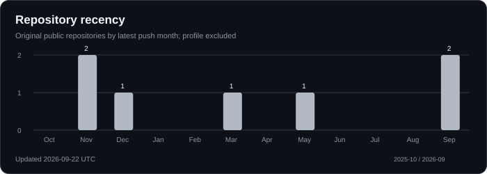
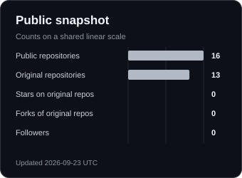
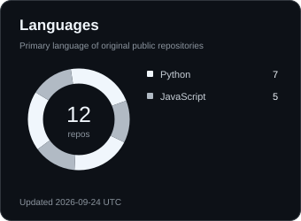

  

<h1 align="center">Mitchel Tu</h1>

  <strong>Software engineering. Applied AI. Systems that move.</strong>

  <a href="https://github.com/mitcheltu?tab=repositories">Projects</a> &nbsp; / &nbsp;
  <a href="Mitchel_Tu_Resume.pdf">Resume</a> &nbsp; / &nbsp;
  <a href="https://www.linkedin.com/in/mitchel-tu-5a404a315/">LinkedIn</a> &nbsp; / &nbsp;
  <a href="mailto:mitcheltu.2@gmail.com">Email</a>

---

### A little context

I'm a software engineering student at **UC Irvine**, with an expected graduation of **June 2028**. I build across applied machine learning, autonomous systems, and web applications, with an interest in connecting models to software people can use.

Currently, I research NBA shot value and statistical modeling with UCI's Department of Statistics and develop campaign management software at EcoServants. Previously, I helped students work through Python programming as a Peer Learning Assistant.

### Tools I reach for

| Layer | Technologies |
| :--- | :--- |
| Languages | Python, Java, C++, JavaScript / TypeScript, SQL, Swift |
| AI and data | PyTorch, XGBoost, scikit-learn, MediaPipe, ONNX |
| Applications | React, Next.js, FastAPI, WebSockets, WebRTC |
| Systems and cloud | ROS 2, Docker, AWS Lambda, Bedrock, DynamoDB, S3, AWS SAM |

### On the workbench

| Project | What I built |
| :--- | :--- |
| [Autonomous LiDAR RC Car](https://github.com/mitcheltu/Lidar-Mapping-Autonomous-RC-Car) | A Swift iOS LiDAR stream, ROS 2 mapping and navigation, and ESP32 motor control for autonomous exploration. |
| [NIMBUS](https://devpost.com/software/nimbus-rbas5u) | Real-time ASL recognition for video calls, combining local gesture detection with an AWS speech pipeline. |
| [Mathnasium Extension](https://github.com/mitcheltu/Mathnasium-Extension) | A Chrome extension using OCR and generated math hints to simplify instructional workflows. |

[Explore all repositories](https://github.com/mitcheltu?tab=repositories)

### The commit trail

  

<strong>More numbers, fewer words</strong>

  
  

Saved in this repository and refreshed daily. Language usage describes repositories, not proficiency. <a href="https://github.com/mitcheltu/mitcheltu/actions/workflows/profile-cards.yml">Last refresh</a>.

Follow my [contribution history](https://github.com/mitcheltu?tab=overview) and explore the code in my [repositories](https://github.com/mitcheltu?tab=repositories).

### Start a conversation

For opportunities, collaborations, or a conversation about a project, reach me at [mitcheltu.2@gmail.com](mailto:mitcheltu.2@gmail.com) or on [LinkedIn](https://www.linkedin.com/in/mitchel-tu-5a404a315/).

[View my resume](Mitchel_Tu_Resume.pdf) for experience, education, and project details.

---

Built one commit at a time.

