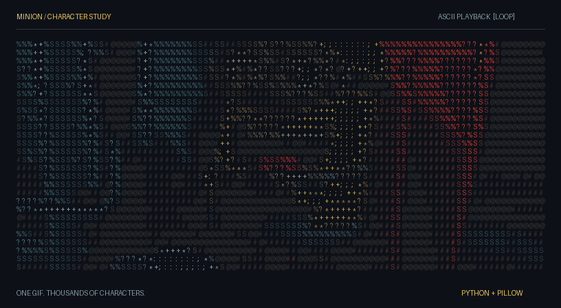
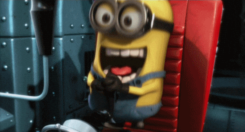
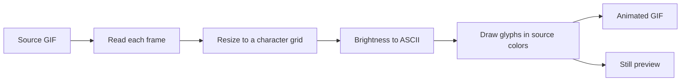

<p align="center">
  
</p>

<h1 align="center">MINION</h1>

<p align="center">
  <strong>A little chaos. A lot of characters.</strong><br>
  A tiny Python experiment that turns a Minion GIF into animated text art.
</p>

<p align="center">
  <a href="https://www.python.org/"></a>
  <a href="https://pillow.readthedocs.io/"></a>
  <a href="assets/minion-ascii.gif"></a>
</p>

<p align="center">
  <a href="#the-experiment">The experiment</a> &nbsp; / &nbsp;
  <a href="#run-it">Run it</a> &nbsp; / &nbsp;
  <a href="#make-it-yours">Make it yours</a> &nbsp; / &nbsp;
  <a href="#contributing">Contributing</a>
</p>

<p align="center">
  
</p>

## The experiment

Each frame is reduced to a grid. Pixel brightness selects a character; the original color gives that character its ink. Put the frames back together and the Minion moves again, one glyph at a time.

The header is a real GIF made of rendered text, so viewing it requires no Python, browser extension, or running server. A still image is available for anyone who prefers a closer look without motion.

<details>
<summary><strong>Inspect a single frame</strong></summary>


</details>

<details>
<summary><strong>Compare it with the source</strong></summary>



</details>

## Run it

Install Python 3.10 or newer. Download this repository, or clone it using the URL from GitHub's **Code** menu, then open a terminal in the project folder.

```sh
python -m venv .venv
```

Activate the environment:

| Platform | Command |
| --- | --- |
| Windows PowerShell | `.venv\Scripts\Activate.ps1` |
| Windows Command Prompt | `.venv\Scripts\activate.bat` |
| macOS / Linux | `source .venv/bin/activate` |

Install the dependency and build the README assets:

```sh
python -m pip install -r requirements.txt
python render_readme.py
```

The renderer writes `assets/minion-ascii.gif`, `assets/minion-ascii-still.png`, and `assets/specs.svg`. It preserves the input frame durations and loops the output continuously. Running it again replaces these generated assets.

<details>
<summary><strong>Keep the original SVG experiment</strong></summary>

The original converter remains available:

```sh
python conversion.py
```

This writes `minion-ascii.svg`: a green, 60-column text animation with a fixed three-second loop. It uses CSS animation and SVG text layout; rendering can vary by viewer. The README uses the rendered GIF for its header.

</details>

## Under the hood



The brightness ramp, from dark to light:

```text
@ # S % ? * + ; : , . [space]
```

| File | Purpose |
| --- | --- |
| [`conversion.py`](conversion.py) | Shared brightness-to-character conversion and the original SVG exporter. |
| [`render_readme.py`](render_readme.py) | Builds the colored ASCII GIF, still preview, and generated specification strip. |
| [`minion.gif`](minion.gif) | Source animation. |
| [`minion-ascii.svg`](minion-ascii.svg) | Original green SVG experiment. |
| [`assets/`](assets/) | Committed images used by this README. |
| [`requirements.txt`](requirements.txt) | Python dependency range. |

## Make it yours

Edit the settings near the top of [`render_readme.py`](render_readme.py), then rerun the renderer.

| Setting | What changes |
| --- | --- |
| `COLUMNS` | Character detail. Higher values create wider images and more glyphs. |
| `CELL_WIDTH`, `CELL_HEIGHT` | Glyph spacing and the output proportions. |
| `BACKGROUND` | Terminal background color. |
| `ASCII_CHARS` in `conversion.py` | The brightness-to-character palette. Keep characters ordered from dark to light. |
| `minion.gif` | Replace the input to render a different animation. |

If you change the input or column count, update the specification image's alt text in this README to match the regenerated strip.

## Use on GitHub

Commit this README together with the `assets/` folder. All project images use relative paths, so the same files work when the repository is renamed or forked. The setup follows [GitHub's guidance for README links and images](https://docs.github.com/en/repositories/managing-your-repositorys-settings-and-features/customizing-your-repository/about-readmes).

The specification strip is generated locally. The Python, Pillow, and output badges are served by Shields.io. No API key or account configuration is needed.

## Contributing

Open an issue for a bug or idea, or submit a focused pull request. For rendering problems, include your Python and Pillow versions, the command you ran, and the error or a screenshot. For visual changes, include a before-and-after preview.

Before submitting a change:

1. Run `python render_readme.py` successfully.
2. Open the GIF and confirm that it animates and the text remains legible.
3. Include regenerated assets when the visual output changes.
4. Check the README preview for broken images and links.

## Credits and license

Image processing uses [Pillow](https://pillow.readthedocs.io/). The Minion character belongs to its respective rights holders; this repository is an unofficial text-art experiment.

No project license is included. This README does not grant permission to reuse the code or source artwork; those rights must be established separately.

---

<p align="center"><sub>Pixels in. Characters out.</sub></p>
